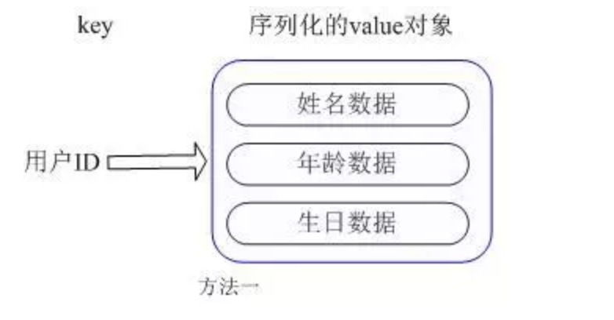

# redis
## 数据结构
- string
此类型和memcache相似，作为常规的key-value缓存应用。
例如微博数、粉丝数等
**注**：一个键最大能存储512MB
- hash
Redis hash是一个string类型的field和value的映射表，hash特别适合用于存储对象(应为对象可能会包含很多属性)hash 结构的数据主要用到的是字典结构
```
struct dictht {
    dictEntry **table;            //entry 数组
    long size;            //数组长度
    Long used            //数组中的元素个数
    …
}
struct dictEntry{
    void *key;                //hash 的 key
    void *val;                //hash 的 value
    dictEntry *next;            //下一个dictEntry 链表结构
}
```
如果hash表中的entry比较多的话，一次完成rehash需要耗费大量的时间，阻塞其它函数操作。所以，在redis中，采用了一种渐进rehash的方法进行rehash，就是每次转移1个，分步转移ht[0]中的entry。redis中设定在执行add、delete、find操作时，执行一次dictRehash(d,1)。
常用命令：hget hset hgetall
**主要用来存储对象信息**

- list
List列表是简单的字符串列表，按照插入顺序排序(内部实现为LinkedList)，可以选择将一个链表插入到头部或尾部
常用命令 :lpush（添加左边元素）,rpush,lpop（移除左边第一个元素）,rpop,lrange（获取列表片段，LRANGE key start stop）等。
应用场景：Redis list的应用场景非常多，也是Redis最重要的数据结构之一，比如twitter的关注列表，粉丝列表等都可以用Redis的list结构来实现。
- set
案例：在微博中，可以将一个用户所有的关注人存在一个集合中，将其所有粉丝存在一个集合。Redis还为集合提供了求交集、并集、差集等操作，可以非常方便的实现如**共同关注、共同喜好、二度好友**等功能，对上面的所有集合操作，你还可以使用不同的命令选择将结果返回给客户端还是存集到一个新的集合中。
- zset
常用命令：zadd,zrange
实现方式：Redis sorted set的**内部使用HashMap和跳跃表(SkipList)来保证数据的存储和有序**，HashMap里放的是成员到score的映射，跳跃表按score从小到大保存所有集合元素。**使用跳跃表的结构可以获得比较高的查找效率**，并且在实现上比较简单。时间复杂度与红黑树相同，增加、删除的操作较为简单。
输入方式
应用场景：排行榜


## Hot Key
即热点 key，指的是在一段时间内，该 key 的访问量远远高于其他的 redis key， 导致大部分的访问流量在经过 proxy 分片之后，都集中访问到某一个 redis 实例上。hot key 通常在不同业务中，存储着不同的热点信息。

解决方案:
利用分片算法的特性，对key进行打散处理
```
//redis 实例数
const M = 16

//redis 实例数倍数（按需设计，2^n倍，n一般为1到4的整数）
const N = 2

func main() {
//获取 redis 实例 
    c, err := redis.Dial(“tcp”, “127.0.0.1:6379”)
    if err != nil {
        fmt.Println("Connect to redis error", err)
        return
    }
    defer c.Close()

    hotKey := "hotKey:abc"
    //随机数
    randNum := GenerateRangeNum(1, N*M)
    //得到对 hot key 进行打散的 key
    tmpHotKey := hotKey + "_" + strconv.Itoa(randNum)

    //hot key 过期时间
    expireTime := 50

    //过期时间平缓化的一个时间随机值
    randExpireTime := GenerateRangeNum(0, 5)

    data, err := redis.String(c.Do(“GET”, tmpHotKey))
    if err != nil {
        data, err = redis.String(c.Do(“GET”, hotKey))
        if err != nil {
            data = GetDataFromDb()
            c.Do(“SET”, “hotKey”, data, expireTime)
            c.Do(“SET”, tmpHotKey, data, expireTime + randExpireTime)
        } else {
            c.Do(“SET”, tmpHotKey, data, expireTime + randExpireTime)
        }
    }
}
```
在这个代码中，通过一个大于等于 1 小于 M * N 的随机数，得到一个 tmp key，程序会优先访问tmp key，在得不到数据的情况下，再访问原来的 hot key，并将 hot key的内容写回 tmp key。值得注意的是，tmp key的过期时间是 hot key 的过期时间加上一个较小的随机正整数，保证在 hot key 过期时，所有 tmp key 不会同时过期而造成缓存雪崩。这是一种通过坡度过期的方式来避免雪崩的思路，同时也可以利用原子锁来写入数据就更加的完美，减小db的压力。

## Big Key
即数据量大的 key ，由于其数据大小远大于其他key，导致经过分片之后，某个具体存储这个 big key 的实例内存使用量远大于其他实例，造成，内存不足，拖累整个集群的使用。big key 在不同业务上，通常体现为不同的数据，比如：论坛中的大型持久盖楼活动

解决方案:
对 big key 存储的数据 （big value）进行拆分，变成value1，value2… valueN,
1. 如果big value 是个大 json通过 mset 的方式，将这个 key 的内容打散到各个实例中，减小big key 对数据量倾斜造成的影响。

//存
mset key1, vlaue1, key2, vlaue2 … keyN, valueN
//取
mget key1, key2 ... keyN

1. 如果big value 是个大list，可以拆成将list拆成 list_1, list_2, list3, listN
2. 其他数据类型同理。

> 在开发过程中，有些 key 不只是访问量大，数据量也很大，这个时候就要考虑这个 key 使用的场景，存储在redis集群中是否是合理的，是否使用其他组件来存储更合适；如果坚持要用 redis 来存储，可能考虑迁移出集群，采用一主一备（或1主多备）的架构来存储。  


## redis是单线程为什么还这么快?

1. 完全基于内存，绝大部分请求是纯粹的内存操作，非常快速。数据存在内存中，类似于HashMap，HashMap的优势就是查找和操作的时间复杂度都是O(1)；
2. 数据结构简单，对数据操作也简单，Redis中的数据结构是专门进行设计的；
3. 采用单线程，避免了不必要的上下文切换和竞争条件，也不存在多进程或者多线程导致的切换而消耗 CPU，不用去考虑各种锁的问题，不存在加锁释放锁操作，没有因为可能出现死锁而导致的性能消耗；
4. 使用多路I/O复用模型，非阻塞IO；
5. 使用底层模型不同，它们之间底层实现方式以及与客户端之间通信的应用协议不一样，Redis直接自己构建了VM 机制 ，因为一般的系统调用系统函数的话，会浪费一定的时间去移动和请求；


