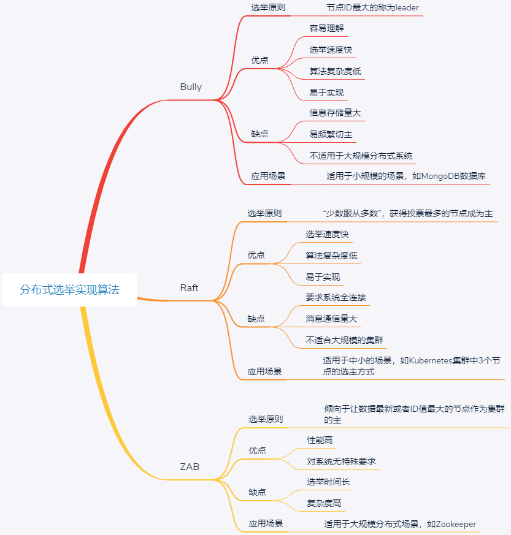

# Bully 算法、Raft算法、ZAB算法
## Bully
Bully 算法在选举过程中，需要用到以下 3 种消息：
- Election 消息，用于发起选举；
- Alive 消息，对 Election 消息的应答；
- Victory 消息，竞选成功的主节点向其他节点发送的宣誓主权的消息。

Bully 算法选举的原则是“长者为大”，意味着它的假设条件是，集群中每个节点均知道其他节点的 ID。在此前提下，其具体的选举过程是：
1. 集群中每个节点判断自己的 ID 是否为当前活着的节点中 ID 最大的，如果是，则直接向其他节点发送 Victory 消息，宣誓自己的主权；
2. 如果自己不是当前活着的节点中 ID 最大的，则向比自己 ID 大的所有节点发送 Election 消息，并等待其他节点的回复；
3. 若在给定的时间范围内，本节点没有收到其他节点回复的 Alive 消息，则认为自己成为主节点，并向其他节点发送 Victory 消息，宣誓自己成为主节点；若接收到来自比自己 ID 大的节点的 Alive 消息，则等待其他节点发送 Victory 消息；
4. 若本节点收到比自己 ID 小的节点发送的 Election 消息，则回复一个 Alive 消息，告知其他节点，我比你大，重新选举。

### 总结
Bully 算法是一种霸道的集群选主算法，为什么说是霸道呢？因为它的选举原则是“长者”为大，即在所有活着的节点中，选取 ID 最大的节点作为主节点。
如 mongoDB

## Raft
- Leader，即主节点，同一时刻只有一个 Leader，负责协调和管理其他节点； 
- Candidate，即候选者，每一个节点都可以成为 Candidate，节点在该角色下才可以被选为新的 Leader；
- Follower，Leader 的跟随者，不可以发起选举。

Raft 选举的流程，可以分为以下几步：
1. 初始化时，所有节点均为 Follower 状态。
2. 开始选主时，所有节点的状态由 Follower 转化为 Candidate，并向其他节点发送选举请求。
3. 其他节点根据接收到的选举请求的先后顺序，回复是否同意成为主。这里需要注意的是，在每一轮选举中，一个节点只能投出一张票。
4. 若发起选举请求的节点获得超过一半的投票，则成为主节点，其状态转化为 Leader，其他节点的状态则由 Candidate 降为 Follower。Leader 节点与 Follower 节点之间会定期发送心跳包，以检测主节点是否活着。
5. 当 Leader 节点的任期到了，即发现其他服务器开始下一轮选主周期时，Leader 节点的状态由 Leader 降级为 Follower，进入新一轮选主。

### 总结
Raft 算法是典型的多数派投票选举算法，其选举机制与我们日常生活中的民主投票机制类似，核心思想是“少数服从多数”。也就是说，Raft 算法中，获得投票最多的节点成为主。  如etcd

## ZAB
- Leader，主节点；
- Follower，跟随者节点；
- Observer，观察者，无投票权。

选举过程中，集群中的节点拥有 4 个状态：
- Looking 状态，即选举状态。当节点处于该状态时，它会认为当前集群中没有 Leader，因此自己进入选举状态。
- Leading 状态，即领导者状态，表示已经选出主，且当前节点为 Leader。
- Following 状态，即跟随者状态，集群中已经选出主后，其他非主节点状态更新为 Following，表示对 Leader 的追随。
- Observing 状态，即观察者状态，表示当前节点为 Observer，持观望态度，没有投票权和选举权。

### 总结
ZAB 选举算法的核心是“少数服从多数，ID 大的节点优先成为主”，因此选举过程中通过 (vote_id, vote_zxID) 来表明投票给哪个节点，其中 vote_id 表示被投票节点的 ID，vote_zxID 表示被投票节点的服务器 zxID。ZAB 算法选主的原则是：server_zxID 最大者成为 Leader；若 server_zxID 相同，则 server_id 最大者成为 Leader。

## 问题
为什么“多数派”选主算法通常采用奇数节点，而不是偶数节点呢？

多数派选主算法的核心是少数服从多数，获得投票多的节点胜出。想象一下，如果现在采用偶数节点集群，当两个节点均获得一半投票时，到底应该选谁为主呢？

答案是，在这种情况下，无法选出主，必须重新投票选举。但即使重新投票选举，两个节点拥有相同投票数的概率也会很大。因此，多数派选主算法通常采用奇数节点。这也是大家通常看到 ZooKeeper、 etcd、Kubernetes 等开源软件选主均采用奇数节点的一个关键原因。