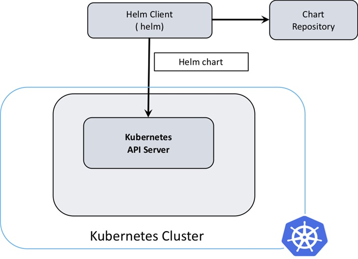
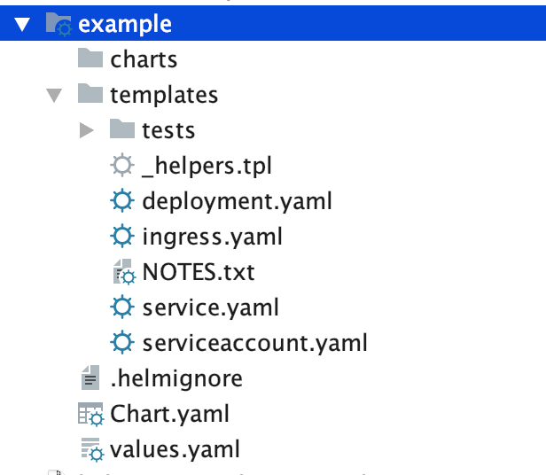
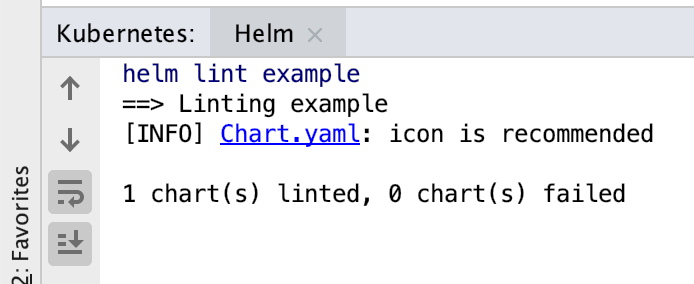

# Helm3
> Helm 是 Kubernetes 的包管理器。包管理器类似于我们在 Ubuntu 中使用的apt、Centos中使用的yum 或者Python中的 pip 一样，能快速查找、下载和安装软件包。Helm 由客户端组件 helm 和服务端组件 Tiller 组成, 能够将一组K8S资源打包统一管理, 是查找、共享和使用为Kubernetes构建的软件的最佳方式。  


## 安装
1. brew
```
brew install helm
```
2. wget
```
wget https://get.helm.sh/helm-v3.0.0-linux-amd64.tar.gz
tar zxvf helm-v3.0.0-linux-amd64.tar.gz
mv linux-amd64/helm /usr/local/bin/helm
#验证
helm version
version.BuildInfo{Version:”v3.0.0”, GitCommit:”e29ce2a54e96cd02ccfce88bee4f58bb6e2a28b6”, GitTreeState:”clean”, GoVersion:”go1.13.4”}
```

## 组件
```
1. helm 是一个命令行工具，用于本地开发及管理chart，chart仓库管理等
2. chart  Helm的打包格式叫做chart，所谓chart就是一系列文件, 它描述了一组相关的 k8s 集群资源
3. release 使用 helm install 命令在 Kubernetes 集群中部署的 Chart 称为Release
4. repoistory Helm chart 的仓库，Helm 客户端通过 HTTP 协议来访问存储库中 chart 的索引文件和压缩包
```

## 原理图
> helm3.0中移除了 Tiller（Helm 2 是一种 Client-Server 结构，客户端称为 Helm，服务器称为 Tiller）。Helm 3 只有客户端结构，客户端仍称为 Helm。如下图所示，它的操作类似于 Helm 2 客户端，但客户端直接与 Kubernetes API 服务器交互。  


## 一个例子
```
helm create example  ##创建一个项目
```

可以看到里面的文件及文件夹

```
.helmignore：构建包时要忽略的模式
Chart.yaml：包含元数据的基本图表说明
values.yaml：图表模板的默认值
charts/：子图表的目录
templates/：图表定义的目录
	_helpers.tpl：模板的部分和功能
	NOTES.txt：部署图表后打印出来的信息
	deployment.yaml：示例Kubernetes部署定义
	ingress.yaml：示例Kubernetes入口定义
	service.yaml：示例Kubernetes服务定义
```

### Chart.yaml 
> 为了保持简洁,我删除了所有注释  
```
apiVersion: v2
name: example
description: A Helm chart for Kubernetes
type: application
version: 0.1.0
appVersion: 1.16.0
```

### values.yaml
```
message: “Hello World”
```

### 删掉templates(我们从0开始,后面慢慢添加)

### 创建NOTES.txt(这个文件里的内容会在 install 之后展示在控制台)
```
This a example for your helm, your message is {{ .Values.message }}
```

### templates文件夹下创建_helpers.tpl文件(这个文件负责定义一些复用的模板)
```
{{/* vim: set filetype=mustache: */}}
{{/*
Expand the name of the chart.
*/}}
{{- define “example.name” -}}
{{- default .Chart.Name .Values.message | trunc 63 | trimSuffix “-“ -}}
{{- end -}}
```

### templates文件夹下创建config-map.yaml文件(很简单的configmap)
```
apiVersion: v1
kind: ConfigMap
metadata:
  name: mychart-configmap
data:
  myvalue: {{ .Values.message }}
```

### 下面，在 example 文件夹下，运行 helm lint 检查我们的语法是否正确。


### 安装charts
```
helm install ./example —generate-name
NAME: example-1575274466
LAST DEPLOYED: Mon Dec  2 16:14:27 2019
NAMESPACE: default
STATUS: deployed
REVISION: 1
TEST SUITE: None
NOTES:
This a example for your helm, your message is Hello World
```

### 查看configmap
```
kubectl get cm
NAME                DATA   AGE
mychart-configmap   1      50s
```

### 创建configmap在运行一次
```
kubectl create ns example

helm install ./example --generate-name --set message="Hello2" --namespace example
NAME: example-1575274639
LAST DEPLOYED: Mon Dec  2 16:17:20 2019
NAMESPACE: example
STATUS: deployed
REVISION: 1
TEST SUITE: None
NOTES:
This a example for your helm, your message is Hello2


helm list --all-namespaces
NAME                    NAMESPACE       REVISION        UPDATED                                 STATUS          CHART           APP VERSION
example-1575274466      default         1               2019-12-02 16:14:27.926909 +0800 CST    deployed        example-0.1.0   1.16.0     
example-1575274639      example         1               2019-12-02 16:17:20.556502 +0800 CST    deployed        example-0.1.0   1.16.0    


helm get manifest example-1575274466
---
# Source: example/templates/config-map.yaml
apiVersion: v1
kind: ConfigMap
metadata:
    name: mychart-configmap
data:
    myvalue: Hello World
```

## 相关命令

添加chart源
> helm repo add aliyuncs https://apphub.aliyuncs.com

查看chart列表
> helm repo list

搜索应用
> helm search repo tomcat

安装远程应用
> helm install my-tomcat aliyuncs/tomcat

拉取chart包
> helm pull aliyuncs/tomcat


本地离线安装
> helm install my-tomcat ./tomcat

获取已安装应用
> helm list --all-namespaces

删除应用
> helm uninstall example-1575274466