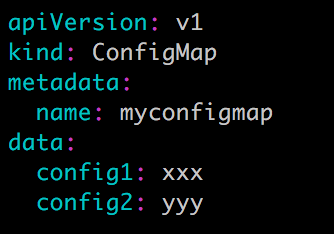
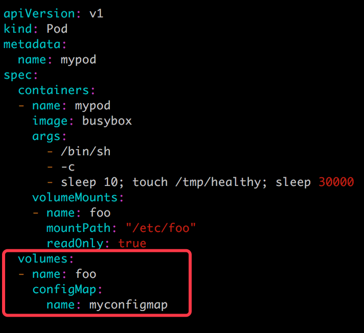
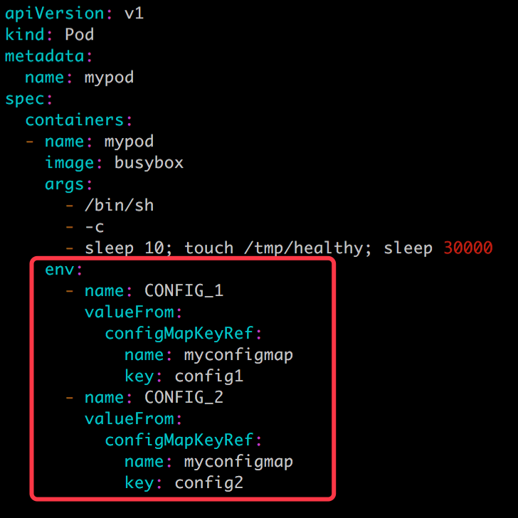
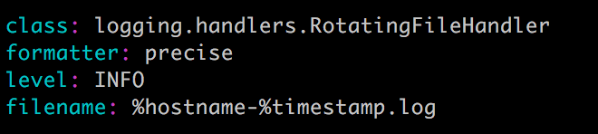
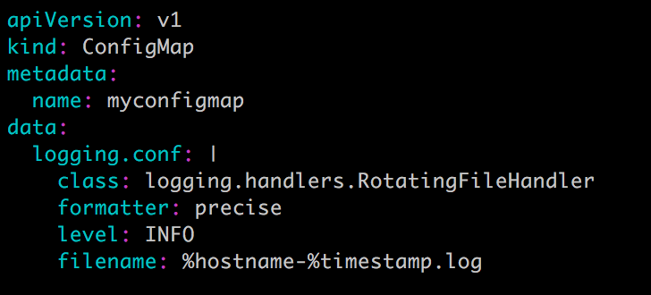
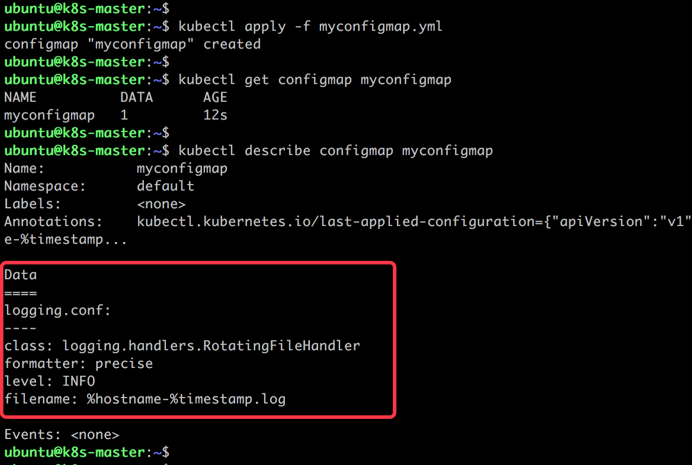
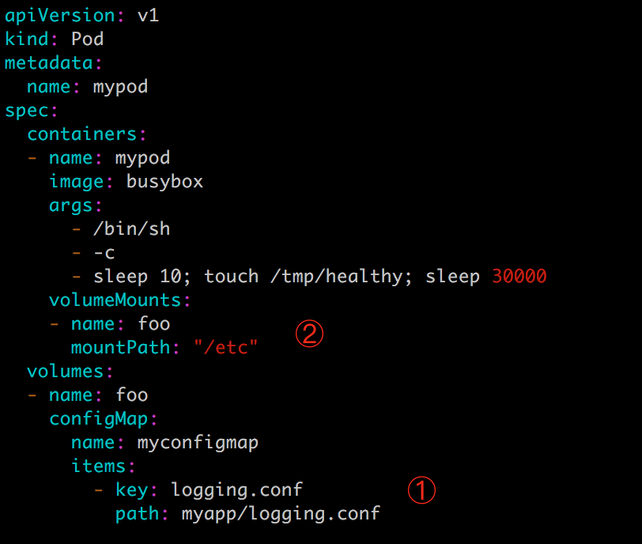
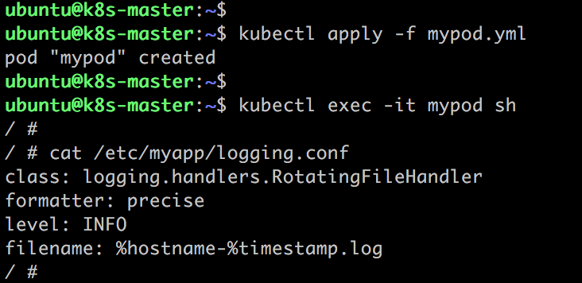

# k8s configmap
> Secret 可以为 Pod 提供密码、Token、私钥等敏感数据；对于一些非敏感数据，比如应用的配置信息，则可以用 ConfigMap。  
> ConfigMap 的创建和使用方式与 Secret 非常类似，主要的不同是数据以明文的形式存放。  
#### 与 Secret 一样，ConfigMap 也支持四种创建方式：
1. 通过 —from-literal：
> kubectl create configmap myconfigmap —from-literal=config1=xxx —from-literal=config2=yyy  
每个 —from-literal 对应一个信息条目。
2. 通过 —from-file：
> echo -n xxx > ./config1  
> echo -n yyy > ./config2  
> kubectl create configmap myconfigmap —from-file=./config1 —from-file=./config2  
每个文件内容对应一个信息条目。
3. 通过 —from-env-file：
```
cat << EOF > env.txt
config1=xxx
config2=yyy
EOF
```
> kubectl create configmap myconfigmap —from-env-file=env.txt  
文件 env.txt 中每行 Key=Value 对应一个信息条目。
4. 通过 YAML 配置文件：
 
文件中的数据直接以明文输入。

#### 与 Secret 一样，Pod 也可以通过 Volume 或者环境变量的方式使用 Secret。
- Volume 方式：

- 环境变量方式：

大多数情况下，配置信息都以文件形式提供，所以在创建 ConfigMap 时通常采用 —from-file 或 YAML 方式，读取 ConfigMap 时通常采用 Volume 方式。
比如给 Pod 传递如何记录日志的配置信息：

可以采用 —from-file 形式，则将其保存在文件 logging.conf 中，然后执行命令：
> kubectl create configmap myconfigmap —from-file=./logging.conf  
如果采用 YAML 配置文件，其内容则为：

注意别漏写了 Key logging.conf 后面的 | 符号。
- 创建并查看 ConfigMap：

- 在 Pod 中使用此 ConfigMap，配置文件为：

	1. 在 volume 中指定存放配置信息的文件相对路径为 myapp/logging.conf。
	2. 将 volume mount 到容器的 /etc 目录。
- 创建 Pod 并读取配置信息：

配置信息已经保存到 /etc/myapp/logging.conf 文件中。与 Secret 一样，Volume 形式的 ConfigMap 也支持动态更新

> 如果信息需要加密，可使用 Secret；如果是一般的配置信息，则可使用 ConfigMap。  
> Secret 和 ConfigMap 支持四种定义方法。Pod 在使用它们时，可以选择 Volume 方式或环境变量方式，不过只有 Volume 方式支持动态更新。  
