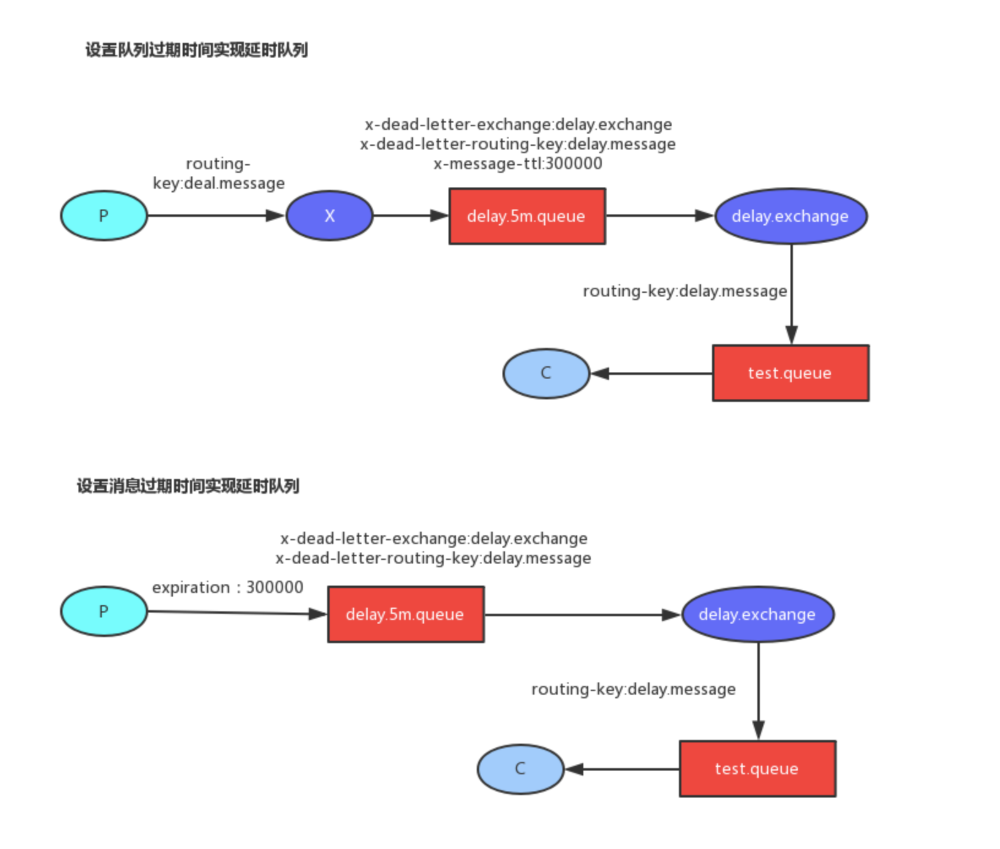

# RabbitMQ
> 支持 持久化、高可用、高可靠 的企业级消息队列系统，自带强大的监控、限流、负载均衡功能  
Broker模式
	1. 点对点队列模式
	2. 发布订阅主题模式
	3. 请求应答模式

1. 点对点队列模式
基本组件
	* 生产者
	* 交换机 
	* 队列
	* 消费者
工作流
	1. 交换机和队列通过key绑定，多个绑定可使用相同key。 
	2. 生产者投递一个消息及key，并经由交换机路由到key匹配的队列中存储
	3. 消费者监听队列获取由其分发的消息并进行处理。 
交换机类型
	* fanout - 广播给所有队列
	* direct - 消息key等于绑定key
	* topic - 消息key匹配绑定key（*表一个词，#表多个词）
	* headers
队列分发模式
	* 循环发放（Round-robin dispatching） - 消费者按序分发
	* 公平发放（fair dispatching） - 消费者空闲就分发，忙则检查下一个消费者
消息确认模式
	* 默认模式 - 消息分发后即删除
	* 确认模式 - 消息处理完毕后返回一个Acknowledgment，然后删除消息

2. 发布订阅主题模式

3. 请求应答模式

## rabbitmq两种延迟队列

